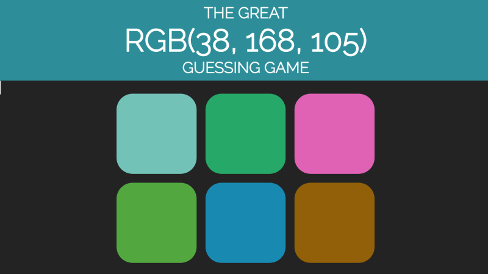

### 3: JAVASCRIPT GUESS THE COLOR GAME

Create a color guessing game with JavaScript!

**Note:** The picture above is only an example - your page does not have to look exactly like this!

1.  Build a game where the player will see a single RGB value for a color.
2.  Underneath, the player will see six boxes with random RGB background colors. 
3.  The user should click on the box with the color they think matches the RGB value displayed.
3.  After the player has guessed, display an alert() box informing them if they were successful.

If (**and only if!**) you finish early, you could add more features to the game.

For example, you could add a "reset" button to generate new colors. Or you could give the player three “lives”. With every wrong guess, they would lose one, and the game would be over when they run out of lives.